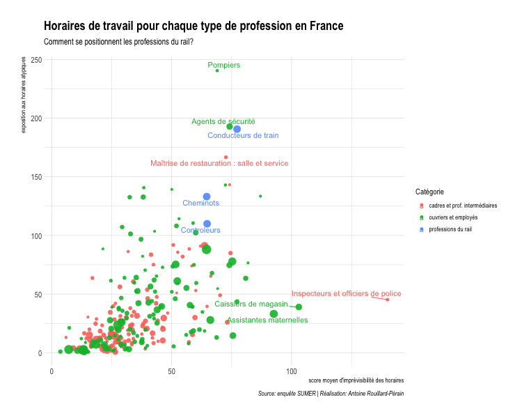

A quick look to French working hours
===================

Overview
--------
In March 2018, massive strikes disrupt train travel in France. A debate is open concerning the condition of train worker in the country. [Antoine Rouillard-Pérain](https://twitter.com/arp_mal) (@arp_mal) decided to dig further and realised a really interesting plot that he published on twitter.

This Github repository is just an attempt to make this analysis reproducible, and to create an interactive version of the chart.

All the credit goes to [Antoine Rouillard-Pérain](https://twitter.com/arp_mal) (@arp_mal).

See the result [here](https://holtzy.github.io/FrenchWorkingTime/).

Original tweet
--------

Static version of the graphic
--------

Interactive version
--------
See [here](https://holtzy.github.io/FrenchWorkingTime/)

